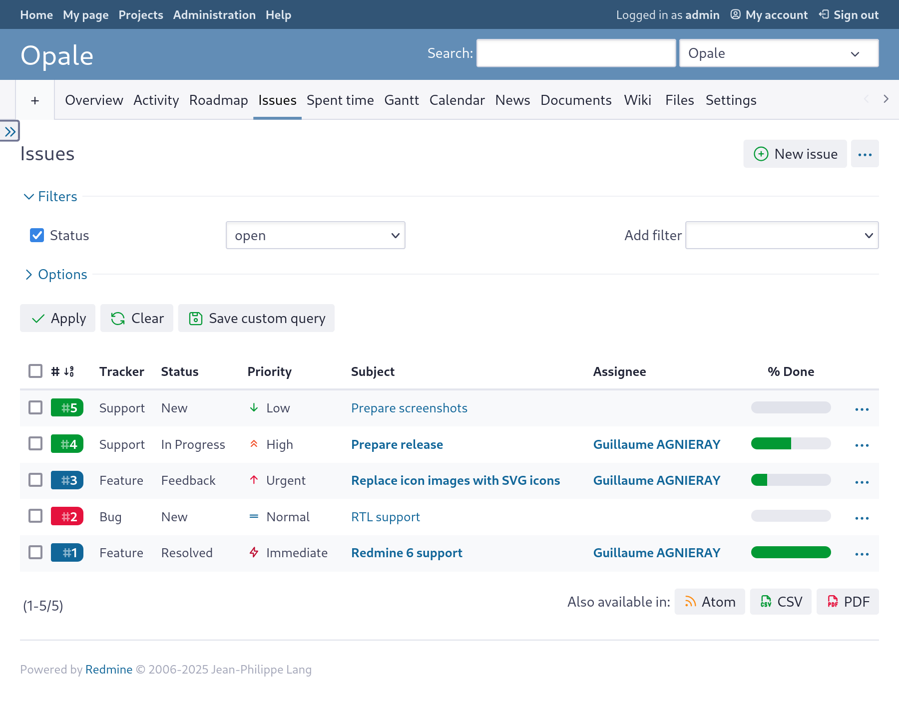

Opale
=====

A Redmine 6.x theme.

[](https://www.gnu.org/licenses/agpl-3.0)
[](https://github.com/gagnieray/opale/actions/workflows/lint.yml)
[](https://github.com/stylelint-scss/stylelint-config-standard-scss)
[](https://github.com/cahamilton/stylelint-config-property-sort-order-smacss)

---



## Main features

* Left sidebar,
* Colored trackers links,
* Jira-inspired priority icons,
* Customizable with SCSS.

## Install

To install this theme [download the lastest release](https://github.com/gagnieray/opale/archive/redmine-6.x.zip) and decompress the archive to your Redmine's `themes` folder.

Then go to `Redmine > Administration > Settings > Display` and select `Opale` from the theme's list and save the settings.

## Customize

If you want to customize Opale to your needs, first, make sure that you have installed [Node.js](https://nodejs.org/) and `npm` is available in your terminal.

Then, from the directory that contains Opale run:

```bash
npm install
```

> [!WARNING]
> In production, never include the `node_module` folder created by this command. Otherwise, if present, it could cause a timeout during assets precompilation.

Now all the dependencies should be ready to use. Run one more command:

```bash
npm run watch
```

And now the grunt is watching for changes in files placed in `src/` folder. Just change what you need, and it'll run Sass preprocessor automatically.

Regrettably, optional file include is not possible in Sass, so I would recommend creating a new file, e.g. `src/sass/_custom-variables.scss` and importing it a the beginning of the `application.scss` file. That way all the variables with the `!default` flag could be overridden.

The path `src/sass/_custom-variables.scss` is added to `.gitignore` so it should make upgrading Opale with keeping your changes rather painless, given that the only thing you changed in Opale's source was adding this one line with `@import "custom-variables";`.

## Contributing

[Bug reports](https://github.com/gagnieray/opale/issues) and [Pull requests](https://github.com/gagnieray/opale/pulls) are welcome.
Please [read more about contributing](./CONTRIBUTING.md).

## Authors

[Read more about the authors](./AUTHORS.md).

## Copying

Opale is licensed under the [Affero General Public License version 3](https://www.gnu.org/licenses/agpl-3.0), the text of which can be found in [LICENSE](./LICENSE), or any later version of the AGPL, unless otherwise noted.

Licensing of included components:
* Normalize.css : [MIT License](https://github.com/necolas/normalize.css/blob/master/LICENSE.md),
* Bootstrap Mixins : [MIT License](https://github.com/twbs/bootstrap/blob/main/LICENSE),
* Tabler Icons: [MIT License](https://github.com/tabler/tabler-icons/blob/main/LICENSE).

All unmodified files from these projects retain their original copyright and license notices: see the relevant individual source files in `src/sass/vendor/`
